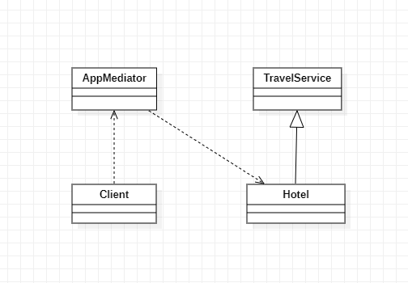

# Padrões de Projeto

## 3. Padrões comportamentais:

---

### 3.1 Mediator

### 3.1.1 Introdução

O mediator é padrão de projeto comportamental que permite que você reduza as dependências caóticas entre objetos. O padrão restringe comunicações diretas e os força a colaborar apenas através do objeto mediador.

- Visa encapsular a comunicação direta entre objetos;
- Desacopla objetos que estariam intimamente ligados;
- Centraliza toda a comunicação em apenas um objeto;

### 3.1.2 Exemplo abordado

Como exemplo para este padrão abordei um App de viagens, onde seria possível comprar passagens aéreas e rodoviárias, agendar hotéis, entre outros serviços de viagens.

### 3.1.3 Diagrama de Classe do Exemplo
